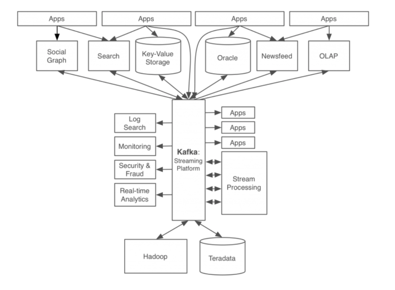
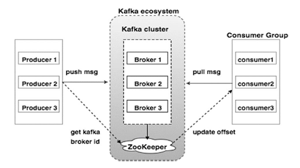

# Kafka Overview

Traditional data integration architectures, predominantly characterized by point-to-point connections, exhibit significant limitations in scalability and system robustness. As organizations face exponential growth in data volumes and processing requirements, these conventional architectures demonstrate inherent constraints in maintaining optimal performance and reliability. Apache Kafka emerged as a solution to address these challenges, offering a robust platform for managing real-time data streams with high throughput and fault tolerance.

Initially developed at LinkedIn, Apache Kafka was conceived in response to the limitations of their existing data management infrastructure. The preliminary system at LinkedIn utilized direct connections between applications and databases, an approach that presented several critical challenges:

1. Architectural Complexity
    - The system architecture lacked transparency in data flow visualization.
    - Operational management became increasingly challenging.
    - Fault isolation and diagnosis required comprehensive examination of all interconnected applications.
2. Pipeline Management Inefficiencies
    - Multiple disparate pipelines existed between applications and data systems.
    - Each pipeline implemented distinct data processing methodologies and formats.
    - System scalability was constrained by the complexity of implementing new pipelines.
    - Data integrity could not be consistently guaranteed across all connections.

The implementation of Apache Kafka has fundamentally transformed LinkedIn's data management infrastructure, as illustrated in the figure above. The architecture now employs a centralised event streaming platform that manages all data flows and events through a unified system. This centralised approach significantly enhances system scalability and data integrity through standardised interfaces and protocols. Furthermore, the platform's standardised message format and communication protocols facilitate seamless integration of new services and systems, thereby reducing architectural complexity and improving system maintainability. 

## Key Architectural Concepts and Characteristics of Apache Kafka

1. Core Architectural Components
    - Topics: Logical channels that serve as the primary abstraction for organising and categorising data streams
    - Partitions: Distributed, ordered sequences of records that enable parallel processing and horizontal scalability
    - Producers: Components that publish messages to specific topics
    - Consumers: Applications that subscribe to topics and process the published message streams
    - Brokers: Distributed servers that maintain and manage the published messages

2. Distibuted System Characteristics
    - Scalability: Horizontal scalability through partition distribution across multiple brokers
    - Fault Tolerance: Replication of partitions across multiple brokers ensures system reliability
    - High Throughput: Efficient disk structures and zero-copy data transfer enable high-performance message handling
    - Message Persistence: Durable storage of messages with configurable retention policies

3. Data Organisation and Management
    - Message Format: Self-contained, immutable records with timestamps and optional key-value pairs
    - Offset Management: Sequential message identifiers enabling precise consumer position tracking
    - Consumer Groups: Logical groupings of consumers that enable parallel processing and load distribution
    - Retention Policies: Configurable message retention based on time or storage constraints

4. Performance Optimisation Features
    - Sequential I/O: Optimised disk access patterns for improved throughput
    - Zero-Copy Principle: Direct transfer of data from disk to network buffers
    - Batching Capabilities: Efficient message grouping for optimized network utilization

This architectural framework enables Kafka to serve as a robust foundation for building scalable, distributed data streaming applications. The combination of these components and characteristics facilitates the development of reliable, high-performance data pipelines while maintaining system flexibility and operational efficiency.